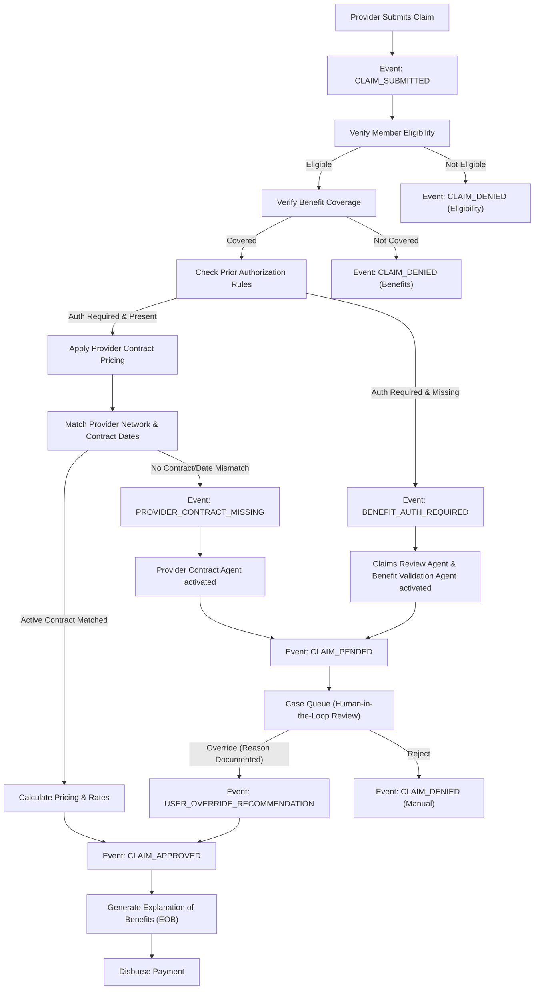
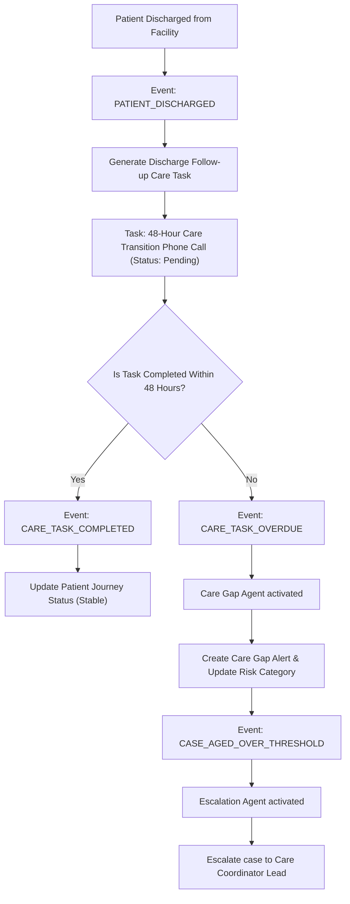

# Healthcare Payer Workflow Map

This document outlines the operational pipelines and event flows within the AHIP platform. AHIP is event-driven; events move cases through lifecycle stages and trigger specialized agents to analyze data and recommend actions.

---

## 1. Claims Lifecycle event Flow

The diagram below details the path of a claim from provider submission to final payout/rejection, highlighting key trigger points where agents intervene to review anomalies.

---

## 2. Care Coordination event Flow

This diagram details how care gaps are identified, tracked, and escalated if post-discharge actions are delayed.

---

## 3. Core Event Triggers & Handoffs

In the AHIP platform, events serve as the glue between modules:
1.  **Ingestion**: A system database change or message queue publishes a `CLAIM_SUBMITTED` event.
2.  **Orchestration**: The `Workflow Orchestration Agent` intercept this event, builds a `Claim Context Pack`, and triggers the `Claims Review Agent` and `Benefit Validation Agent` in parallel.
3.  **Observation**: If either agent detects a discrepancy (e.g., a missing PA document or a missing contract mapping), it emits an anomaly event (`BENEFIT_AUTH_REQUIRED` or `PROVIDER_CONTRACT_MISSING`).
4.  **Escalation**: These anomaly events change the claim status to `PENDED` and trigger the `Escalation Agent` to calculate risk prioritization.
5.  **Audit**: Any human operational decision (e.g., overriding a pended state) triggers a `USER_OVERRIDE_RECOMMENDATION` event, which writes a permanent record to the `AuditLogs` table.
